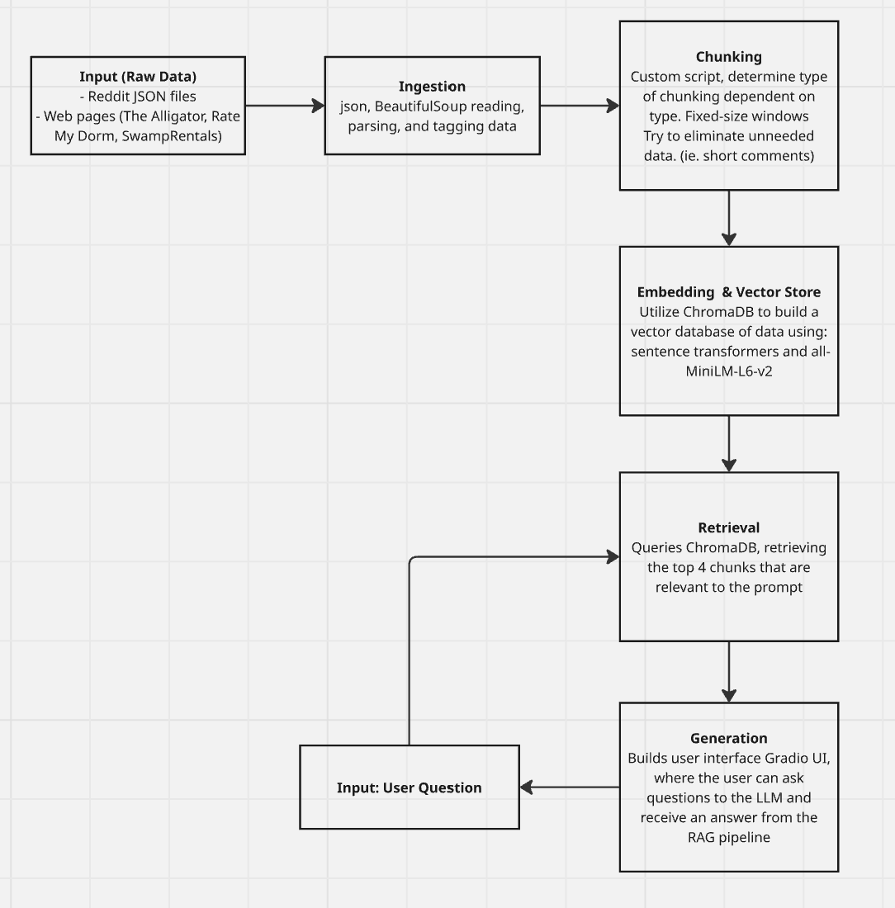

# Project 1 Planning: The Unofficial Guide

> Write this document before you write any pipeline code.
> Your spec and architecture diagram are what you'll use to direct AI tools (Claude, Copilot, etc.) to generate your implementation — the more specific they are, the more useful the generated code will be.
> Update the Retrieval Approach and Chunking Strategy sections if you change your approach during implementation.
> Update this file before starting any stretch features.

---

## Domain

<!-- What domain did you choose? Why is this knowledge valuable and hard to find through official channels? -->

On-campus and Off-Campus Housing at the University of Florida. 

Thousands of students at the University of Florida need somewhere to live that fits their individual needs, such as cost, apartment amenties, location, and proximity to the Gainesville campus. The University of Florida offers plenty of on-campus options to live, but some students may prefer off-campus versions. Additionally, quality of individual apartment complexes may vary significantly and information is typically spread through word of mouth, instead of official channels for both on-campus dormitories and off-campus apartments do not want to diminish their reputations. The Unofficial Guide aims to help students decide between on-campus and off-campus options based on anecdotal data from students.

---

## Documents

<!-- List your specific sources: URLs, subreddit names, forum threads, or file descriptions.
     Aim for at least 10 sources that together cover different subtopics or perspectives within your domain. -->

| # | Source | Description | URL or location |
|---|--------|-------------|-----------------|
| 1 | The Alligator: "A look inside UF Residence Halls" | Individual reviews for all of the on-campus housing options from the Alligator, an independent student newspaper. | https://residencehalls.alligator.org/|
| 2 | Reddit r/ufl: "What off campus housing is the best at UF? " | Reddit forum with student-responses about off-campus housing options and their respective opinions from living there. | https://www.reddit.com/r/ufl/comments/1jkdc8f/what_off_campus_housing_is_the_best_at_uf/ |
| 3 | Reddit r/ufl: "Should freshmen live on or off campus?"  | Student perspectives debating to live on or off campus for both economical and social perspectives | https://www.reddit.com/r/ufl/comments/1q3vwbj/should_freshmen_live_on_or_off_campus/ |
| 4 | SwampRentals: "What are the pros and cons of living in apartments in Gainesville vs the dorms on campus?" | Article from UF-specific student apartment locator/finder explaining differences between living on campaus and off campus. | https://www.swamprentals.com/help-finding-apartments/off-campus-vs-dorm |
| 5 | RateMyDorm | Ranking of on-campus housing options from 110 different student reviews on RateMyDorm's website, only shares 1 per unit | https://www.ratemydorm.com/ranking-dorms/university-of-florida |
| 6 | Reddit r/ufl "Any off-campus recommendations?" | Reddit forum thread highlighing off-campus apartment recommendations. | https://www.reddit.com/r/ufl/comments/154pr4g/any_offcampus_recommendations/ |
| 7 | Reddit r/ufl " Is off campus first year that bad as people say? " | Reddit thread discussing life off-campus for first-year students.| https://www.reddit.com/r/ufl/comments/1ie69mb/is_off_campus_first_year_that_bad_as_people_say/ |
| 8 | Reddit r/ufl "What are some good off-campus housing options?" | Reddit forum listing popular off-campus housing options | https://www.reddit.com/r/ufl/comments/189gg0/what_are_some_good_offcampus_housing_options/ |
| 9 | Reddit r/ufl "Dorm Reviews for UF 2024 (Or Anyone Else)" | Reddit forum reviewing most (since this is an older post) of the housing options that are on campus. | https://www.reddit.com/r/ufl/comments/fbgqnq/dorm_reviews_for_uf_2024_or_anyone_else/ |
| 10 |Reddit r/ufl "Landlords/Apartments to Avoid" | Reddit forum listing "bad" apartments to avoid. Some comments debate some of the listed apartments. | https://www.reddit.com/r/ufl/comments/ll5qbp/landlordsapartments_to_avoid/ |

---

## Chunking Strategy

<!-- How will you split documents into chunks?
     State your chunk size (in tokens or characters), overlap size, and explain why those
     numbers fit the structure of your documents.
     A review-heavy corpus warrants different chunking than a long FAQ. -->

**Chunk size:**
1000 characters.

**Overlap:**
200 characters

**Reasoning:**

Chunk size varies depending on the type of document. Since we are working with both shorter reddit posts and comments with complete thoughts and longer blog-style posts, it would be better to chunk these differently to help our program to ensure context within a chunk is best-fit.

---

## Retrieval Approach

<!-- Which embedding model are you using (e.g., all-MiniLM-L6-v2 via sentence-transformers)?
     How many chunks will you retrieve per query (top-k)?
     If you were deploying this for real users and cost wasn't a constraint, what tradeoffs
     would you weigh in choosing a different embedding model — context length, multilingual
     support, accuracy on domain-specific text, latency? -->

**Embedding model:**
all-MiniLM-L6-v2
**Top-k:**
4
**Production tradeoff reflection:**
Increasing the top-k can provide more context to the LLMs, as you provide more chunks for the LLMs at the cost of increasing the number of tokens used. The LLM we use allow for different context lengths, which helps inform how much of the "top-k" we can use or even increasing the chunk size to help better give context to LLM queries. Additionally, the type of LLM we use have other constraints, such as what written languages are supported (English, Spanish, Chinese, etc.). Providing more context could also bring more accurate content for domain-specific text.

---

## Evaluation Plan

<!-- List your 5 test questions with their expected correct answers.
     Questions should be specific enough that you can judge whether the system's response
     is right or wrong. "What are good dining halls?" is too vague.
     "What do students say about wait times at [dining hall name] during lunch?" is testable. -->

| # | Question | Expected answer |
|---|---------------------------------------------------------------|-----------------|
| 1 | What are some cons of living on-campus for freshman students? | |
| 2 | What are some pros of living on campus for students? | |
| 3 | Can you list some of the available dorms on campus? | |
| 4 | Can you list some off-campus apartment complexes? | |
| 5 | What are some of the benefits of living at Murphree Hall? | |

---

## Anticipated Challenges

<!-- What could go wrong? Name at least two specific risks with reasoning.
     Consider: noisy or inconsistent documents, missing source attribution, off-topic
     retrieval, chunks that split key information across boundaries. -->

1. Noisy data, a lot of the parsing and grabbing the data to fill the vector database contains nonsense data, such as shorter reddit comments (which are chunked individually), and non-content text on HTML pages.

2. Not enough data. For example most of the data provided by our sources do not depict cons of individual dorms, and instead it focuses on positives.

---

## Architecture

<!-- Draw a diagram of your pipeline showing the five stages:
     Document Ingestion → Chunking → Embedding + Vector Store → Retrieval → Generation
     Label each stage with the tool or library you're using.
     You can use ASCII art, a Mermaid diagram, or embed a sketch as an image.
     You'll use this diagram as context when prompting AI tools to implement each stage. -->

---

## AI Tool Plan

<!-- For each part of the pipeline below, describe:
     - Which AI tool you plan to use (Claude, Copilot, ChatGPT, etc.)
     - What you'll give it as input (which sections of this planning.md, which requirements)
     - What you expect it to produce
     - How you'll verify the output matches your spec

     "I'll use AI to help me code" is not a plan.
     "I'll give Claude my Chunking Strategy section and ask it to implement chunk_text()
     with my specified chunk size and overlap" is a plan. -->

**Milestone 3 — Ingestion and chunking:**
I want to use ChatGPT and Google Gemini to help research how to gather data between Reddit posts and other web pages. I asked ChatGPT to additionally assist to help implement load and chunking functions. I expect the code to be able to print and organize the raw text. I'll verify through printing out what is printed out by the code.

**Milestone 4 — Embedding and retrieval:**
I want to use ChatGPT and Google Gemini to understand how this pipeline works, and how to incorporate ChromaDB and sentence transformers into my code. I'll ask ChatGPT how to set up both individually to help write and generate the vector database. I will verify the data by printing the output of the retrival (evaluate()) functions and determine if the chunks generated are relevant to the query. If not, I will go back to the ingestion step.

**Milestone 5 — Generation and interface:**
I will use ChatGPT and Google Gemini to help support connecting the previous functions created in earlier milestones to the provided code of the Gradle UI. To verify, I will be able to properly make queries through the Gradle UI and recieve a response from Groq.